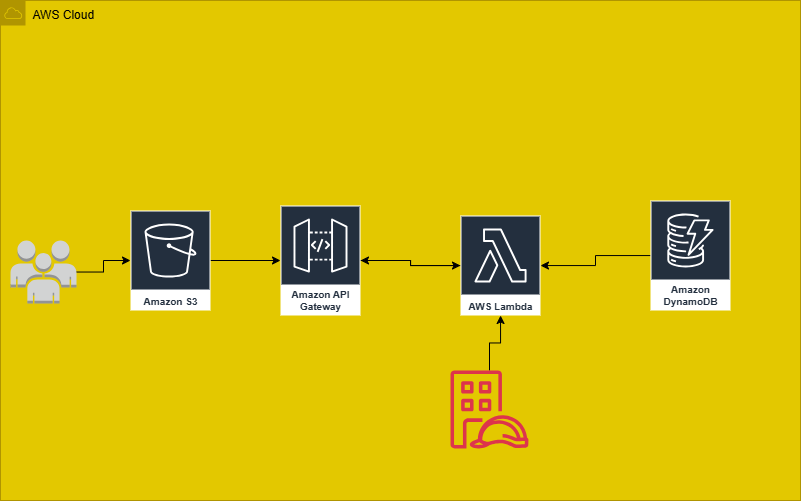

# 🎓 Campus Management System on AWS

This project is a simple **Campus Management System** built entirely using AWS serverless services.  
It allows adding courses, registering students, and recording attendance with a lightweight frontend.

---

## 🚀 Architecture
- **Amazon S3** → Hosts the static website (HTML + JS).
- **Amazon API Gateway** → Handles HTTP requests from the frontend.
- **AWS Lambda** → Contains backend logic written in Python.
- **Amazon DynamoDB** → Stores data for:
  - Courses
  - Students
  - Attendance

---

## ⚡ How to Deploy
1. Upload `frontend/index.html` to **Amazon S3** (with static website hosting enabled).
2. Create **DynamoDB tables**:
   - `Courses` (Partition key: `course_id`)
   - `Students` (Partition key: `student_id`)
   - `Attendance` (Partition key: `course_id`, Sort key: `date_student`)
3. Deploy **Lambda function** using `backend/lambda_function.py`.
4. Create **API Gateway** endpoints:
   - `/courses` → POST
   - `/students` → POST
   - `/attendance` → POST
5. Enable **CORS** for all endpoints.
6. Update the API URL in `index.html`.

---

## ✨ Features
- Add and manage **courses**.
- Register **students**.
- Record **attendance** with status.
- Fully **serverless** architecture.
- Scalable and cost-efficient.

---

## 📌 Author
Built with ❤️ using AWS by [kyrellos hany].

